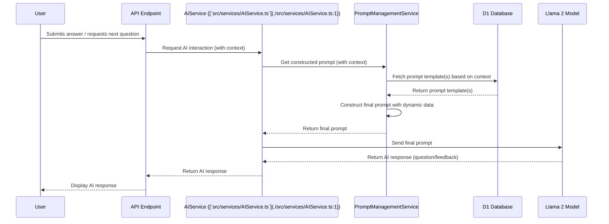

# AI Prompt Enhancement Plan

## 1. Introduction

This document outlines a plan to enhance the AI prompting system for the 'perfect-pitch' AI interview platform. The primary goal is to improve the quality of AI-generated questions and feedback, making them more natural, context-aware, targeted, and ultimately more effective for users.

This plan considers the existing architecture, including the use of Llama 2 as the core AI model (as per [`docs/ARCHITECTURE.md`](./docs/ARCHITECTURE.md)) and the D1 database for storage (referenced in [`docs/D1_DATABASE_PLAN.md`](./docs/D1_DATABASE_PLAN.md)).

The key objectives of this enhancement are:

- Increased flexibility in prompt management and updates.
- Dynamic prompt generation tailored to specific interview contexts.
- Capability for A/B testing different prompt strategies.
- Improved user experience through more relevant and human-like AI interactions.

## 2. Research: Advanced Prompt Engineering Techniques

**IMPORTANT NOTE ON PENDING RESEARCH:** The successful and optimal implementation of the strategies outlined in this plan, particularly concerning advanced prompt engineering techniques, is contingent upon a dedicated research phase. This research should validate assumptions, explore state-of-the-art methods, confirm specific technical choices, and refine implementation details. Proceeding with implementation without completing this research may lead to suboptimal AI performance or unforeseen challenges.
Effective prompt engineering is crucial for maximizing the performance of Large Language Models (LLMs) like Llama 2. This phase should focus on identifying state-of-the-art techniques applicable to conversational AI in interview scenarios.

**Note:** The research step (e.g., using MCP tools like Perplexity or Firecrawl) cannot be performed in the current "Architect" mode. This research should be conducted by switching to an appropriate mode or through manual investigation.

Key research areas should include:

- **Contextual Prompting:** Strategies for incorporating interview type, specific skills being assessed, user's progress, previous answers, and desired difficulty into prompts.
- **Role-Playing Prompts:** Techniques to make the AI adopt specific interviewer personas effectively.
- **Chain-of-Thought (CoT) & Few-Shot Prompting:** Leveraging these methods to guide the AI towards more reasoned and accurate responses or question generation.
- **Natural Language Generation:** Techniques for generating varied, engaging, and less repetitive questions and feedback.
- **Targeted Question Generation:** Strategies for eliciting specific types of information (e.g., STAR method for behavioral questions, probing technical depth, generating relevant follow-up questions).
- **Constructive Feedback Prompts:** How to prompt the AI to provide feedback that is specific, actionable, and balanced.
- **Bias Mitigation:** Identifying and applying techniques to minimize bias in AI-generated content stemming from prompts.
- **Prompt Chaining/Sequencing:** Designing sequences of prompts for multi-turn interactions.
- **Self-Correction/Refinement Prompts:** Techniques where the AI can be prompted to review and refine its own output.

The findings from this research will directly inform the design of prompt templates and the dynamic construction logic.

## 3. Architectural Design

The enhanced prompting system will be designed for flexibility, manageability, and testability.

### 3.1. Prompt Storage (D1 Database)

Prompt templates will be stored in the D1 database. This approach offers several advantages:

- **Centralized Management:** Prompts are managed in one place, separate from application code.
- **Easy Updates:** Prompts can be updated without requiring code deployments.
- **Versioning:** Database records can support versioning of prompts, allowing for rollback and tracking changes.
- **A/B Testing Support:** Different versions or sets of prompts can be flagged for A/B tests.
- This aligns with the existing use of D1 as outlined in [`docs/D1_DATABASE_PLAN.md`](./docs/D1_DATABASE_PLAN.md).

### 3.2. Dynamic Prompt Construction

A new `PromptManagementService` will be responsible for:

- Fetching appropriate prompt templates from D1 based on criteria such as:
  - Interview Type (from [`docs/INTERVIEW_TYPES_DB_MIGRATION_PLAN.md`](./docs/INTERVIEW_TYPES_DB_MIGRATION_PLAN.md:1))
  - Skills being assessed
  - User's current progress within the interview
  - Previous questions and answers (for context)
  - Desired difficulty level
  - A/B testing flags
- Injecting dynamic data (e.g., user's previous answer, skill name, scenario details) into placeholders within the selected template.
- Assembling the final, complete prompt to be sent to the Llama 2 model.

A standardized placeholder syntax (e.g., `{{variable_name}}`) will be used in prompt templates.

### 3.3. A/B Testing Mechanism

The system will support A/B testing of different prompts to empirically determine effectiveness:

- Prompt templates in D1 can be associated with A/B tests.
- The `PromptManagementService` will select prompt variants for users/sessions based on A/B test allocation logic (e.g., random assignment, user cohorts).
- Performance metrics (see Evaluation Strategies) will be tracked for each variant.

### 3.4. [`AIService.ts`](./src/services/AIService.ts:1) Modifications

The existing [`src/services/AIService.ts`](./src/services/AIService.ts:1) will be refactored to integrate with the new `PromptManagementService`.

- Instead of constructing prompts directly (if it currently does so) or using hardcoded prompts, [`AIService.ts`](./src/services/AIService.ts:1) will request a fully constructed prompt from the `PromptManagementService`.
- It will pass necessary contextual information (e.g., `interviewId`, `userId`, `currentQuestionNumber`, `previousInteraction`) to the `PromptManagementService`.
- The core responsibility of [`AIService.ts`](./src/services/AIService.ts:1) will remain interacting with the Llama 2 model, but with prompts supplied by the new service.

### 3.5. Data Flow Diagram

This diagram illustrates the flow of information from user interaction to receiving a response from the AI, highlighting the roles of the new `PromptManagementService` and D1 database.

## 4. Implementation Steps

### 4.1. D1 Database Schema for Prompts

The following tables will be added to the D1 database (schema details are illustrative and subject to refinement based on research and [`docs/D1_DATABASE_PLAN.md`](./docs/D1_DATABASE_PLAN.md)):

- **`PromptTemplates`**

  - `id` (PK, UUID/Integer)
  - `name` (TEXT, unique, e.g., "Behavioral Initial Question - Teamwork")
  - `template_text` (TEXT, the prompt template with placeholders)
  - `prompt_category` (TEXT, e.g., 'INITIAL_QUESTION', 'FOLLOW_UP_QUESTION', 'POSITIVE_FEEDBACK', 'CONSTRUCTIVE_FEEDBACK', 'SCORING_RUBRIC')
  - `interview_type_id` (FK, references `InterviewTypes` table from [`docs/INTERVIEW_TYPES_DB_MIGRATION_PLAN.md`](./docs/INTERVIEW_TYPES_DB_MIGRATION_PLAN.md:1), optional)
  - `skill_tags` (TEXT, comma-separated or JSON array of relevant skills, e.g., "communication,problem-solving")
  - `version` (INTEGER, default 1)
  - `status` (TEXT, e.g., 'ACTIVE', 'ARCHIVED', 'EXPERIMENTAL_A', 'EXPERIMENTAL_B', default 'ACTIVE')
  - `llm_model_target` (TEXT, e.g., 'llama2-7b', 'llama2-13b', default 'llama2')
  - `notes` (TEXT, optional, for internal comments)
  - `created_at` (TIMESTAMP)
  - `updated_at` (TIMESTAMP)

- **`PromptTemplateVersions`** (Optional, for more granular version history if needed beyond a simple version number)

  - `id` (PK)
  - `prompt_template_id` (FK, references `PromptTemplates`)
  - `version` (INTEGER)
  - `template_text` (TEXT)
  - `notes` (TEXT)
  - `created_at` (TIMESTAMP)

- **`ABTests`**

  - `id` (PK)
  - `name` (TEXT, descriptive name for the test)
  - `description` (TEXT, optional)
  - `prompt_category_target` (TEXT, e.g., 'FOLLOW_UP_QUESTION')
  - `status` (TEXT, 'DRAFT', 'RUNNING', 'PAUSED', 'COMPLETED')
  - `start_date` (TIMESTAMP)
  - `end_date` (TIMESTAMP, optional)
  - `created_at` (TIMESTAMP)

- **`ABTestVariants`**
  - `id` (PK)
  - `ab_test_id` (FK, references `ABTests`)
  - `prompt_template_id` (FK, references `PromptTemplates`)
  - `variant_name` (TEXT, e.g., 'A', 'B', 'Control')
  - `allocation_percentage` (INTEGER, 0-100)
  - `created_at` (TIMESTAMP)

### 4.2. Prompt Management Service (`PromptManagementService.ts`)

- **Responsibilities:**
  - CRUD operations for `PromptTemplates` and related A/B testing tables (likely via an admin interface, but service methods needed).
  - `getPrompt(context)`: Core method to select and construct a prompt.
    - Input `context` object: `{ interviewType, skills, userProgress, previousInteractions, targetCategory, abTestGroup, ... }`.
    - Logic to query D1 for suitable templates based on context and A/B testing status.
    - Placeholder replacement logic.
- **Location:** Likely within `src/services/`.

### 4.3. Update [`AIService.ts`](./src/services/AIService.ts:1)

- Modify methods that interact with Llama 2.
- Call `PromptManagementService.getPrompt(context)` to obtain the prompt string.
- Pass the constructed prompt to the Llama 2 API.
- Ensure all necessary contextual data is gathered and passed to the `PromptManagementService`.

### 4.4. Admin Interface for Prompt Management (Plan)

A simple web-based admin interface will be crucial for managing prompts without developer intervention.

- **Purpose:** Allow curriculum designers, interview experts, or administrators to create, edit, version, and A/B test prompts.
- **Key Features:**
  - List, view, create, edit, and archive `PromptTemplates`.
  - Manage versions of prompts.
  - Define and manage `ABTests` and their `ABTestVariants`.
  - Assign prompts to A/B test variants.
  - View basic A/B test allocation.
  - Preview prompts with sample dynamic data.
  - Filter/search prompts by category, skills, interview type.
- **Technology (Considerations):**
  - Could leverage Hono and JSX as per [`docs/HONO_JSX_MIGRATION_PLAN.md`](./docs/HONO_JSX_MIGRATION_PLAN.md) for a lightweight solution integrated into the existing stack.
  - Alternatively, a separate admin tool could be considered if complexity grows.
- **Access Control:** Secure this interface, potentially using roles defined in [`docs/LUCIA_AUTH_PLAN.md`](./docs/LUCIA_AUTH_PLAN.md).

### 4.5. Seeding Initial Prompts

- Develop a base set of high-quality prompt templates for various interview types, skills, and prompt categories.
- Create a seeding script or process to populate the D1 tables with these initial prompts.

## 5. Evaluation Strategies

The effectiveness of new and existing prompts will be continuously evaluated.

### 5.1. User Feedback

- **In-app ratings:** Allow users to rate the quality/relevance of questions and feedback.
- **Qualitative feedback:** Collect textual feedback on specific interactions.
- **Post-interview surveys:** Gather overall satisfaction and specific comments on the AI's conversational abilities.

### 5.2. AI Performance Metrics

- **Question Relevance:** Measured by human review or proxy metrics (e.g., user continuing the interview).
- **Naturalness & Fluency:** Assessed via user ratings and potentially linguistic analysis.
- **Engagement:** Interview completion rates, average session duration.
- **Feedback Quality:** Clarity, actionability, and perceived accuracy of AI feedback (user-rated and expert-reviewed).
- **Task Success Rate:** For specific interview goals, how often does the AI successfully guide the user or elicit the target information.
- **A/B Test Metrics:** Compare the above metrics between different prompt variants in A/B tests.

### 5.3. A/B Testing Analysis

- Define clear KPIs for each A/B test before launch.
- Use appropriate statistical methods to determine if differences between variants are significant.
- Iterate on prompts based on A/B test results, promoting successful variants.

## 6. Potential Challenges & Mitigation

### 6.1. Prompt Complexity and Maintenance

- **Challenge:** As the number and complexity of prompt templates grow, they can become difficult to manage and maintain consistency.
- **Mitigation:**
  - Clear naming conventions and categorization for prompts.
  - Modular design of prompt components where possible.
  - Comprehensive documentation for prompt creators.
  - The admin interface should provide good search, filtering, and preview capabilities.
  - Regular audits of the prompt library.

### 6.2. Maintaining Conversational Context

- **Challenge:** Ensuring Llama 2 effectively uses the conversational history, especially with dynamically assembled prompts. The context window of the LLM is a hard limit.
- **Mitigation:**
  - Design prompts to explicitly include summaries of relevant prior turns.
  - Develop strategies for context summarization if the full history is too long.
  - Carefully manage the information passed into prompt placeholders.
  - Continuously monitor and test context handling.

### 6.3. Ensuring Unbiased AI Responses

- **Challenge:** Prompts can inadvertently introduce or amplify biases in AI-generated content.
- **Mitigation:**
  - Follow guidelines from prompt engineering research on bias reduction.
  - Train prompt creators on bias awareness.
  - Regularly review prompts and AI outputs for potential biases by a diverse team.
  - Incorporate user feedback channels specifically for reporting biased responses.
  - Consider using external bias detection tools if available and feasible.

### 6.4. Scalability of Prompt Retrieval

- **Challenge:** Performance of querying and retrieving prompts from D1 as the library grows.
- **Mitigation:**
  - Optimize D1 table schemas and queries (e.g., appropriate indexing on `prompt_category`, `interview_type_id`, `status`).
  - Implement caching strategies for frequently accessed or generic prompt templates in the `PromptManagementService`.

### 6.5. Versioning and Rollback

- **Challenge:** Managing changes to prompts and quickly rolling back to a previous version if a new prompt causes issues.
- **Mitigation:**
  - Implement robust versioning for `PromptTemplates` in D1.
  - Use the `status` field to control active prompts; new prompts can start as 'EXPERIMENTAL'.
  - Thorough A/B testing before fully rolling out significant prompt changes.
  - Maintain a history of changes, possibly in the `PromptTemplateVersions` table or via audit logs.

## 7. Integration with Existing Plans

This AI Prompt Enhancement Plan integrates with and builds upon several existing planning documents:

- [`docs/ARCHITECTURE.md`](./docs/ARCHITECTURE.md): Leverages Llama 2 as the core LLM and fits within the overall system architecture. The new `PromptManagementService` becomes a key component.
- [`docs/D1_DATABASE_PLAN.md`](./docs/D1_DATABASE_PLAN.md): Extends the D1 database usage with new tables specifically for prompt management, adhering to established D1 practices.
- [`docs/LUCIA_AUTH_PLAN.md`](./docs/LUCIA_AUTH_PLAN.md): User identity and roles managed by Lucia Auth can be used to personalize prompts or control access to the prompt admin interface.
- [`docs/HONO_JSX_MIGRATION_PLAN.md`](./docs/HONO_JSX_MIGRATION_PLAN.md): Provides a potential technology stack (Hono and JSX) for building the admin interface for prompt management.
- [`docs/TTS_INTEGRATION_PLAN.md`](./docs/TTS_INTEGRATION_PLAN.md): The quality and structure of AI-generated questions and feedback (driven by prompts) will directly impact the naturalness and effectiveness of the Text-to-Speech output.
- [`docs/INTERVIEW_TYPES_DB_MIGRATION_PLAN.md`](./docs/INTERVIEW_TYPES_DB_MIGRATION_PLAN.md:1): `InterviewTypes` will be a key criterion for selecting appropriate prompts, requiring integration with the schema defined in this plan.
